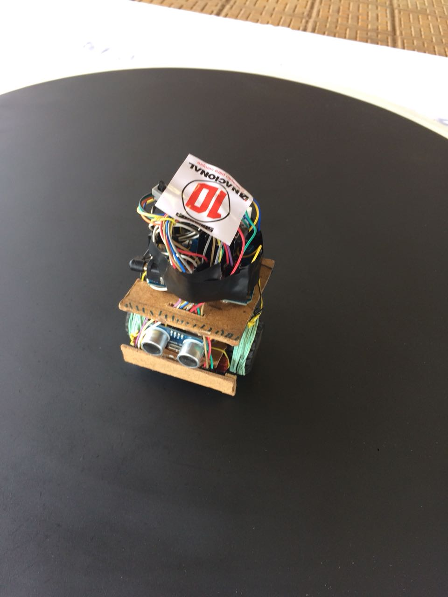

# Robô lutador de sumô

Projeto desenvolvido para a competição [SumốCup](http://www.lasec.feelt.ufu.br/sumocup) realizada em outubro de 2017 na Universidade Federal de Uberlândia e organizada pelo [LASEC](http://www.lasec.feelt.ufu.br/).

## Overview

Este projeto possui conceitos bem simples de programação em linguagem C e usa a logica condicional para o seu sistema de controle. O Capitão Guyniu foi criado usando a IDE do arduino UNO R3.

## Materiais utilizados

* Arduino UNO R3
* Micro motor com caixa de redução 1000 rpm
* Sensores de refletância
* Sensor ultrassom
* Drive ponte H l298
* Jumpers
* Protoboard
* Push Buttons

## Estrégia utilizada

Foram criadas três funções neste código, a função **procura** a função **ataque** e a função **voltar ao campo**.

Na função **procura** o robô se dirige ao centro do dojo e procura o adversário rodando no própio eixo, quando o advesário é encontrado, pelo sensor ultrassom, a função **ataque** é chamada e o robô empurra-o com toda a força para fora do dojo. Caso o robo saia do centro, por ser empurrado ou para atacar, a função **voltar ao campo** é chamada, ela impede que o robô saia do dojo.

## hardware

Abaixo podemos ver uma foto do robô já montado:



Neste [link](https://www.youtube.com/watch?v=NO75CmzcxgI&list=PLWZrpNc7OyMwNlyV_De-JO6rOj_Rl_izD&t=0s&index=2) têm alguns videos da competição.

##licenses

This project is licensed under the MIT License - see the [LICENSE.md](LICENSE.md) file for details

```
"THE BEERWARE LICENSE" (Revision 42):
Italo Fernandes, Mario Borges and Luiz Henrique wrote this code.
As long as you retain this notice, you can do whatever you want with this stuff.
If we meet someday, and you think this stuff is worth it, you can buy us a beer in return.
```

## Authors

* **Mario Borges** - https://github.com/alpinista06

* **Jabora** - https://github.com/jabora

* **Guilherme Balduino** - https://github.com/guibalduino
